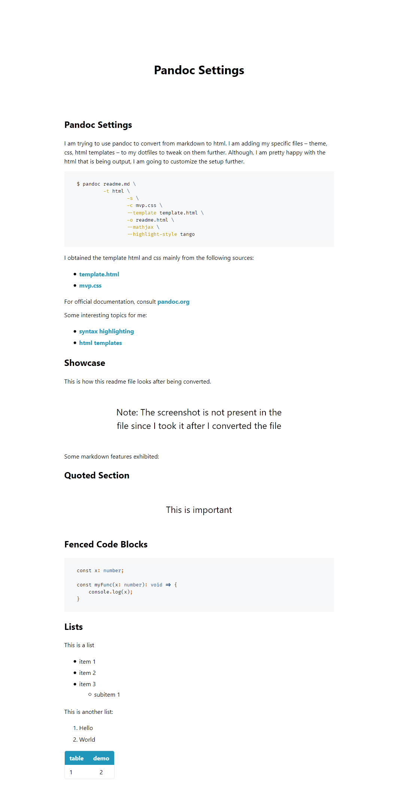

# Pandoc Settings
I am trying to use pandoc to convert from markdown to html. I am adding my specific files -- theme, css, html templates -- to my dotfiles to tweak on them further. Although, I am pretty happy with the html that is being output, I am going to customize the setup further.

```sh
$ pandoc readme.md \
         -t html \
				 -s \
				 -c mvp.css \
				 --template template.html \
				 -o readme.html \
				 --mathjax \
				 --highlight-style tango
```

I obtained the template html and css mainly from the following sources:

* [template.html](https://gitlab.com/vimalkvn/pandoc-mvp-css)
* [mvp.css](https://andybrewer.github.io/mvp/)

For official documentation, consult [pandoc.org](https://pandoc.org/MANUAL.html)

Some interesting topics for me:

* [syntax highlighting](https://pandoc.org/MANUAL.html#syntax-highlighting)
* [html templates](https://pandoc.org/MANUAL.html#templates)

## Showcase
This is how this readme file looks after being converted.



Some markdown features exhibited:

## Quoted Section

> This is important

## Fenced Code Blocks
```typescript
const x: number;

const myFunc(x: number): void => {
	console.log(x);
}
```

## Lists
This is a list

* item 1
* item 2
* item 3
	* subitem 1

This is another list:

1. Hello
1. World

| table | demo |
|-------|------|
| 1     | 2    |
