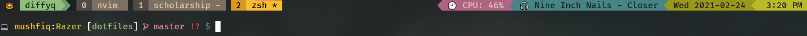
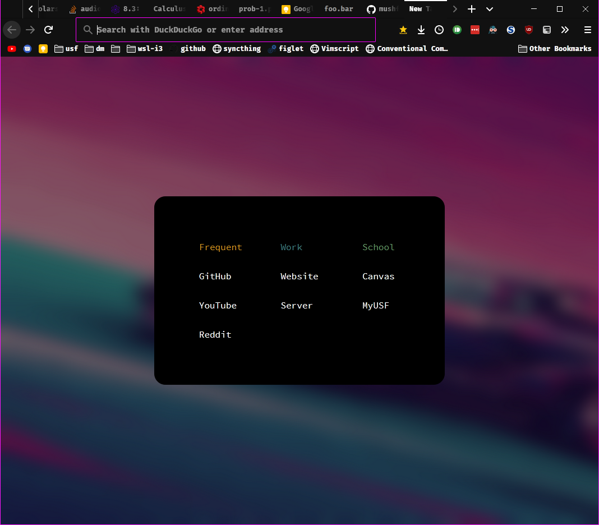

# Dotfiles

My configuration files for different programs that I use. This repo uses [GNU Stow](https://www.gnu.org/software/stow/) to automatically create symlinks to the relevant directories and files from the user home directory `~`.

## My setup

| Part               | Details                                                                                |
|--------------------|----------------------------------------------------------------------------------------|
| Device             | Razer Blade Stealth - 3200x1800 13.3" QHD+ - RZ09-02393E32-R3U1                        |
| CPU                | Intel(R) Core(TM) i7-8550U @ 2.001GHz                                                  |
| RAM                | 16.0 GB                                                                                |
| OS                 | Arch Linux                                                                             |
| Shell              | zsh 5.9                                                                                |
| Terminal Emulator  | Kitty                                                                                  |
| Window Manager     | i3-gaps                                                                                |
| Editor             | NeoVim 0.9.0                                                                           |
| Browser/PDF Reader | QuteBrowser                                                                            |
| Font               | [LigaSauceCodePro Nerd Font](https://github.com/Bo-Fone/Liga-Sauce-Code-Pro-Nerd-Font) |
| Colorscheme        | Various (see `./scripts/colorscheme/colors/*.json`)                                    |

## How it Looks


## Setup!

Make sure `stow` is installed

```sh
$ sudo apt install stow
```

Use stow to create or remove symbolic links for different programs

## Link config files

* Create directory with name of program for which the config files will be linked e.g. `zsh`.
* Recreate config directory structure in this directory. For instance, `neovim` would have the following directory structure:

  ```sh
  neovim
  └── .config
      └── nvim
          └── init.vim
  ```

Then run one of the following. Note: `<program_dir_name>` refers to the name created in the first step.

```sh
# for testing out use -n
$ stow -nSvt ~ <program_dir_name>
# for actually creating the link
$ stow -Svt ~ <program_dir_name>
# in case config already exists, use --adopt to force stow to link
$ stow --adopt -Svt ~ <program_dir_name>
```
For `<program_dir_name>`, use the top level directory name that is in the repo, e.g. `neovim`, `zsh`, `bash`

## Unlink config files
```sh
# for testing out use -n
$ stow -nDvt ~ <program_dir_name>
# for actually creating the link
$ stow -Dvt ~ <program_dir_name>
# in case config already exists, use --adopt to force stow to link
$ stow --adopt -Dvt ~ <program_dir_name>
```

## Stow Terminology

* __target dir__: the directory where the linked files will be created.
  * this is the directory the files/dir would ideally be at without gnu stow
  * example: for neovim, this would be `~/.config/nvim`
* __source dir__: the directory where the linked files will be sourced from.
  * this is the directory the files/dir would actually be at
  * example: for neovim, this would be `~/dotfiles/neovim/.config/nvim`

### No Target Directory

If the target directory is empty and source directory is __NOT__ empty, i.e.

```bash
$ tree ~/.config/test
# /home/mushfiq/.config/test  [error opening dir]
#
# 0 directories, 0 files
$ tree -a ~/dotfiles/test
# /home/mushfiq/dotfiles/test
# └── .config
#     └── test
#         └── test.rc
#
# 2 directories, 1 file
$ cat ~/dotfiles/test/.config/test/test.rc
# from dotfiles
```

Then the target directory contents will be linked to the source directory contents. This also works if there are other files that are in the target directory that are also not in the source directory. e.g., if there was a second file in `~/.config/test/another.rc` and `stow` was called, that file will remain unchanged.

```bash
$ stow --adopt --verbose --target=$HOME --no-folding --stow test
$ tree ~/.config/test
# /home/mushfiq/.config/test
# └── test.rc -> ../../dotfiles/test/.config/test/test.rc
#
# 0 directories, 1 file
$ cat ~/.config/test/test.rc
# from dotfiles
$ cat ~/dotfiles/test/.config/test/test.rc
# from dotfiles
```

### Target Directory with contents

If both the source directory and the target directory is __NOT__ empty, the files in the source directory will get overwritten by the target. i.e.

```bash
$ tree -a ~/.config/test/
# /home/mushfiq/.config/test/
# ├── another.rc
# └── test.rc
#
# 0 directories, 2 files
$ cat ~/.config/test/test.rc
# from config dir
$ cat ~/dotfiles/test/.config/test/test.rc
# from dotfiles
$ stow --adopt --verbose --target=$HOME --no-folding --stow test
$ cat ~/.config/test/test.rc
# from config dir
$ cat ~/dotfiles/test/.config/test/test.rc
# from config dir
$ tree -a ~/dotfiles/test/.config/test
# /home/mushfiq/dotfiles/test/.config/test
# └── test.rc
#
# 0 directories, 1 file
```

## More Screenshots

### Tmux Status



### Firefox



### Visual Studio Code


