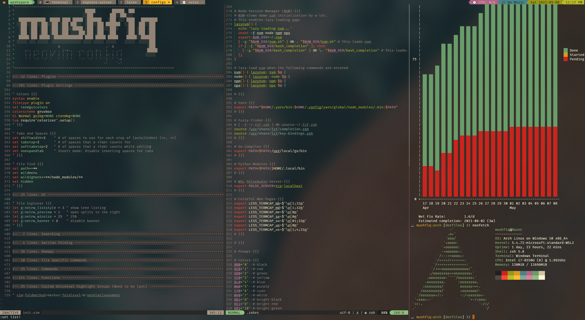
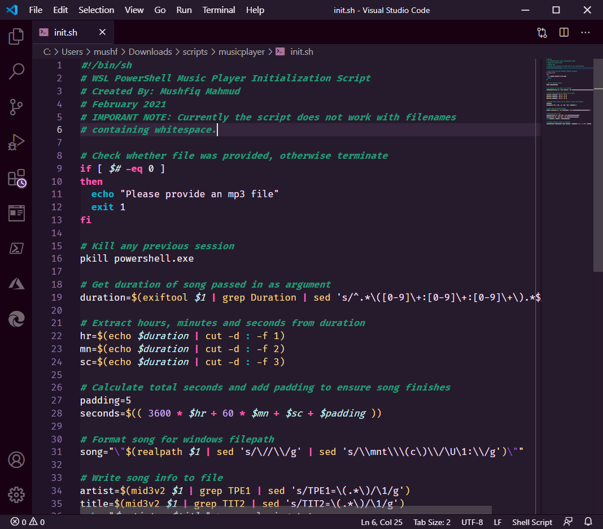

# Dotfiles
My configuration files for different programs that I use. This repo uses [GNU Stow](https://www.gnu.org/software/stow/) to automatically create symlinks to the relevant directories and files from the user home directory `~`.

## My setup
| Part                    | Details                                                                                              |
|-------------------------|------------------------------------------------------------------------------------------------------|
| Device                  | Razer Blade Stealth - 3200x1800 13.3" QHD+ - RZ09-02393E32-R3U1                                      |
| CPU                     | Intel(R) Core(TM) i7-8550U @ 2.001GHz                                                                |
| RAM                     | 16.0 GB                                                                                              |
| OS                      | Ubuntu 18.04.5 LTS on Windows 10 x86_64                                                              |
| Shell                   | zsh 5.4.2                                                                                            |
| Terminal Emulator       | Windows Terminal                                                                                     |
| Terminal Window Manager | Tmux                                                                                                 |
| Editor                  | NeoVim 0.4.4                                                                                         |
| Browser/PDF Reader      | Mozilla FireFox                                                                                      |
| Font                    | [Fira Code Nerd Font](https://github.com/ryanoasis/nerd-fonts/releases/download/v2.1.0/FiraCode.zip) |
| Colorscheme (Terminal)  | Gruvbox Dark                                                                                         |
| Colorscheme (Editor)    | Gruvbox Dark                                                                                         |

## How it Looks


## Setup
Make sure `stow` is installed

```sh
$ sudo apt install stow
```

Use stow to create or remove symbolic links for different programs

## Link config files
* Create directory with name of program for which the config files will be linked e.g. `zsh`.
* Recreate config directory structure in this directory. For instance, `neovim` would have the following directory structure:

	```sh
	neovim
	└── .config
	    └── nvim
	        └── init.vim
	```

Then run one of the following. Note: `<program_dir_name>` refers to the name created in the first step.

```sh
# for testing out use -n
$ stow -nSvt ~ <program_dir_name>
# for actually creating the link
$ stow -Svt ~ <program_dir_name>
# in case config already exists, use --adopt to force stow to link
$ stow --adopt -Svt ~ <program_dir_name>
```
For `<program_dir_name>`, use the top level directory name that is in the repo, e.g. `neovim`, `zsh`, `bash`

## Unlink config files
```sh
# for testing out use -n
$ stow -nDvt ~ <program_dir_name>
# for actually creating the link
$ stow -Dvt ~ <program_dir_name>
# in case config already exists, use --adopt to force stow to link
$ stow --adopt -Dvt ~ <program_dir_name>
```

## More Screenshots
### Tmux Status


I will add screenshots for the other programs soon.

### Firefox


### Visual Studio Code

